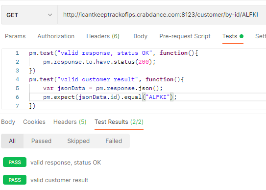

# Rest API Project.

## Introduction

Authors: Jamie Scofield, Billie Parsons, Vlad Logyin, Dogukhan Karapinar, Yanaki Kolarov.

Database Name: Northwind

## Available endpoints:

- /customers
    - /by-id/{id} GET
    - /customers GET
    - /customer POST
    - /customer PUT
    - /customer/by-id/{customerID} DELETE
- /products
    - /by-id/{id} GET
    - /by-id/{id}/stock GET
    - /product/new POST
    - /product/update PUT
    - /product/delete DELETE
    - /product/new CREATE
- /employee
    - /employees GET
    - /employee/by-id GET
    - /employees/by-title GET
    - /employee POST
    - /employee PUT
    - employee/by-id DELETE
- /category
    - /category/by-id GET
    - /category GET
    - /category PUT
    - /category/by-id Delete
  
The project was to create an API based on the northwind database so that either customers, employees and some senior members of staff access and edit parts of the database.
These followed the CRUD methodology (Create, Read, Update, Delete)
## The tables that were used

The tables that was accessed was the Category, Customer, Employee and Product Entity.These were chosen based on how they
are interlinked and they happen to be at the top of the database. Using plugins such as JPA Buddy and ROBO POJO Generator.
These allowed us to use annotations to easily access a database and assign entities to the tables that we wanted to use.

## Controllers

For each table a controller classed was made. Each class used the Autowired annotation to tell spring to look at the corresponding interface.
For each command in the api is divided up into the CRUD style mapping. These included allowing the user to use GET Mapping the corresponding entity by there ID key.
Also using the GET mapping to  return all the entities in a given table. Furthermore, for the employee entity it allows employers to return all employees by a given title as well as the others.
For the product controller users will be able to return entities by category and returning the stock of a given product ID.
All of these controllers will have the ability to use PUT mapping, POST mapping and DELETE mapping enabling the user the edit the database.

## Tests 

We created a test file for each of the tables of the Northwind database to separately test their api endpoints. 
We struggled initially when covering methods other than GET, but eventually we managed to create tests for Delete and PUT using two different techniques, including 
MockMVC and HTTPurl connections. Some tests require further work to be done in order for the API to meet our expectations, but we did our best to complete the assignment in the given period of time.
Additionally, we created tests separately using the PostMan application.

